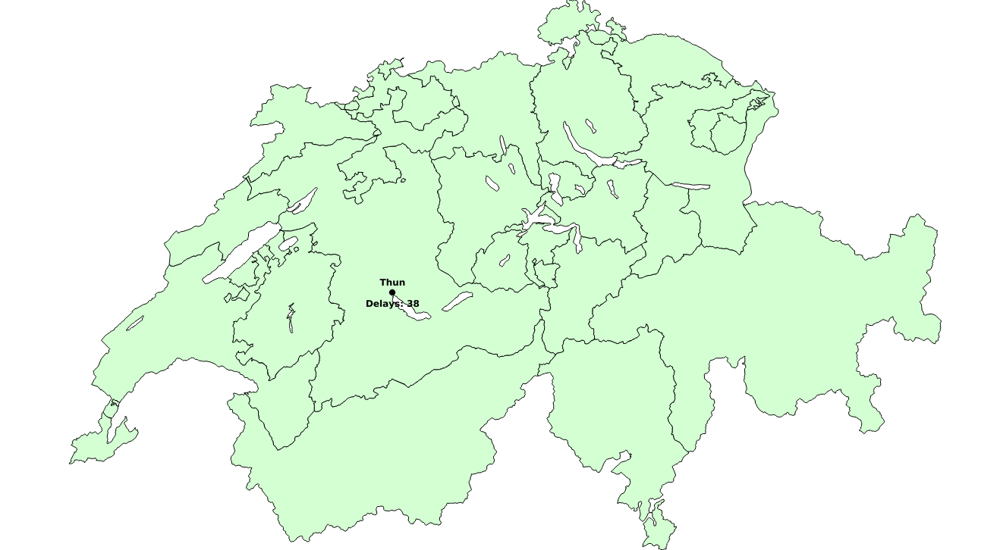

# Visualisierung von Verspätungen der SBB
Dieses Projekt hat das Ziel, die Zugsverspätungen grösserer Städte innerhalb der Schweiz zu visualisieren. Also Geotool wird dazu QGIS verwendet. Um die Daten zu beziehen, wird die [SBB-API](https://data.sbb.ch/explore/dataset/ist-daten-sbb/api/) verwendet. Die visualisierten Daten beziehen sich jeweils auf den Vortag.

## QGIS + Python

## Leaflets

